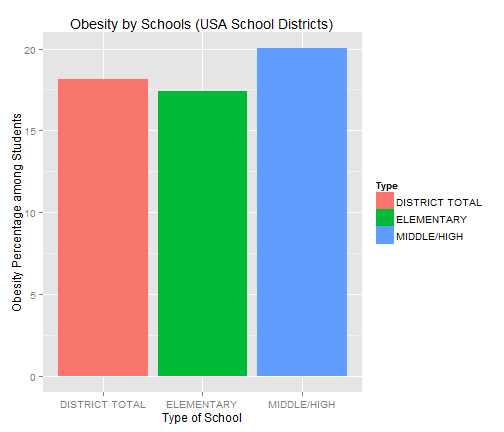

## Interpret Your BMI? (School Example)
##### Here's an R-generated Chart showing BMI data for different schools
##### Source: http://health.data.ny.gov/api/views/es3k-2aus/rows.csv
 

---

## Why Monitor Your BMI?
1. Rising obesity epidemic
2. Foretells other health issues
3. Start at an early age

